# 如何自訂全家冰店的地圖

### [目標]
利用**全家店舖查詢**販售**霜淇淋**的店家資訊，彙整成CSV檔後匯入至[Google我的地圖](https://www.google.com/mymaps/?hl=zh-TW "我的地圖")建立自訂地點並分享。

### [任務]

- 使用網頁瀏覽器查詢特定商家資訊
- 將查詢店家資訊收集成一般文字檔
 > 這個部份目前需要人工完成！
- 將收集的店家資訊，透過程式轉換成CSV檔
- 匯入CSV檔至Google我的地圖
- 完成自訂地圖並分享

### [執行步驟]

1. 使用瀏覽器登入[全家店舖查詢-手機版](https://www.family.com.tw/mobile/wtb/shop_search.aspx "店舖查詢")網頁。

 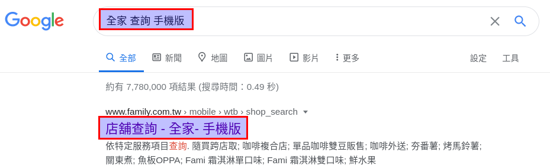

2. 選擇**依特定服務項目查詢**來查詢相關店家。

 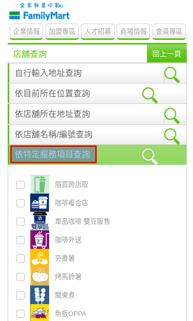

3. 選擇**霜淇淋單口味**及**霜淇淋雙口味**作為服務條件進行查詢。
 > 不過，我並不清楚單口味跟雙口味的差別。但最後發現其實使用單口味作為條件，可以查詢到較多店家。

 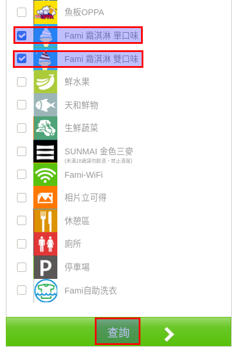

4. 後續就會進入**店舖查詢**，選擇**所在縣市** > **所在鄉鎮區**。這裡以**台北市**為例。

 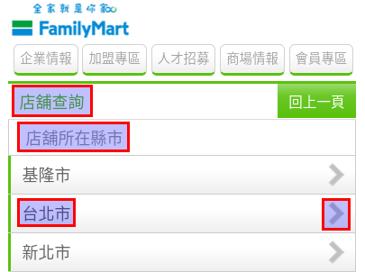
 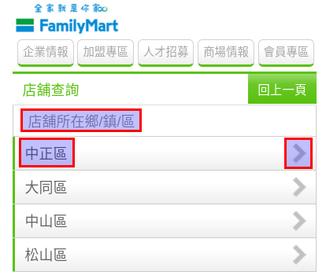

 在**所在街道名稱**中，選擇**街道名稱**，這裡以**中山南路**為例。

 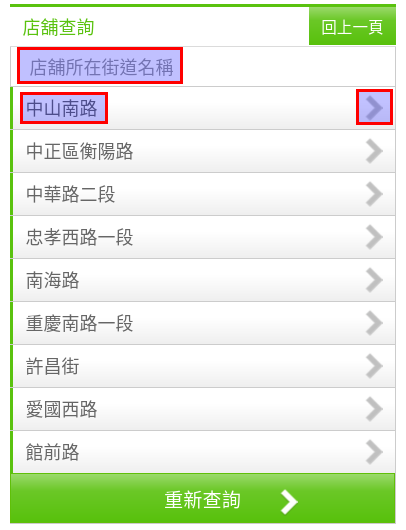

 會出現**鄰近店舖**，點選該店舖名稱資訊。

 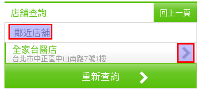

5. 終於進入**店舖資訊**，使用滑鼠**複製整個店家資訊**。

 > 這裡目前使用人工，所以未來AI時代資料輸入還是有工作的。

 > 至於之後會不會改用程式處理？不會！成本太高不符合效益進行開發。

 > 如果你對其他縣市資料補齊有興趣，請跟我聯繫！

 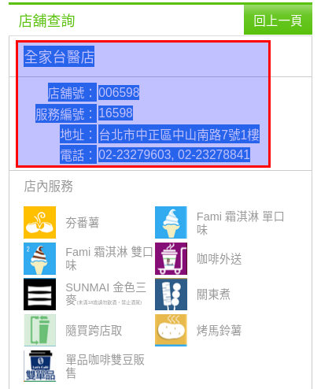

6. 按照上述步驟，將所需**店家資訊貼入至一般文字檔案**即可。這裡以高雄市作為範例。

 對的，只要**重複複製、貼上**的動作去完成！

 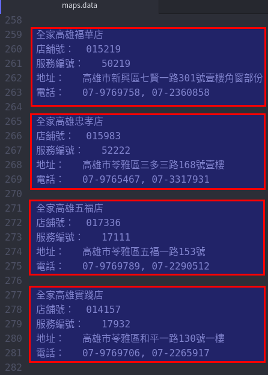

7. 上述資料大致輸入了360行左右。接著用程式來整理這個文字檔。

 透過以下的命令，可以將資料整理以下格式。
 ```bash
  sed -e 's/\ \t//' -e 's/：/:/' -e 's/^\(全家.*$\)/店舖名稱:\1/' -e 's/^店舖號/店舖編號/' ${dataFile}
 ```

 ```bash
 店舖名稱:全家梓官蚵仔寮店
 店舖編號:019335
 服務編號:57746
 地址:高雄市梓官區漁港二路13號
 電話:07-9769063, 07-6107313

 店舖名稱:全家彌陀虱目魚店
 店舖編號:018940
 服務編號:52938
 地址:高雄市彌陀區中正路50號一樓
 電話:07-9721705, 07-6101475

 店舖名稱:全家大樹義城店
 店舖編號:019339
 服務編號:18738
 地址:高雄市大樹區學城路一段12號(商店街12,13號)
 電話:07-9741811, 07-6568076
 ```

8. 接著就是要將整理過的店家資訊，分別將各個項目取出。

 ```bash
 index () {
   key=${1}
   cat ${dataTempFile} | grep ${key} | cut -d: -f2 | sed -e 's/\ //' -e 's/,/;/g'
 }

 storeName=($(index "店舖名稱"))
 storeNum=($(index "店舖編號"))
 storeServiceNum=($(index "服務編號"))
 storeAddress=($(index "地址"))
 storeTelephone=($(index "電話"))
 ```

9. 好了，最後把所有資訊整合成CSV檔案吧。直接執行撰寫好的腳本檔**mapConvert2Csv.sh**。其實不到1秒就處理完成了！這次總共轉換了60家店舖資訊。

 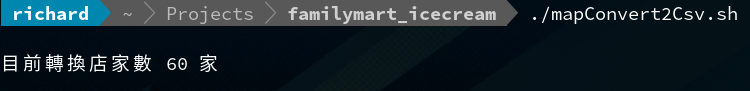

 顯示完成的CSV檔，可以發現剛剛的文字檔格式已經轉換成CSV檔格式了。

 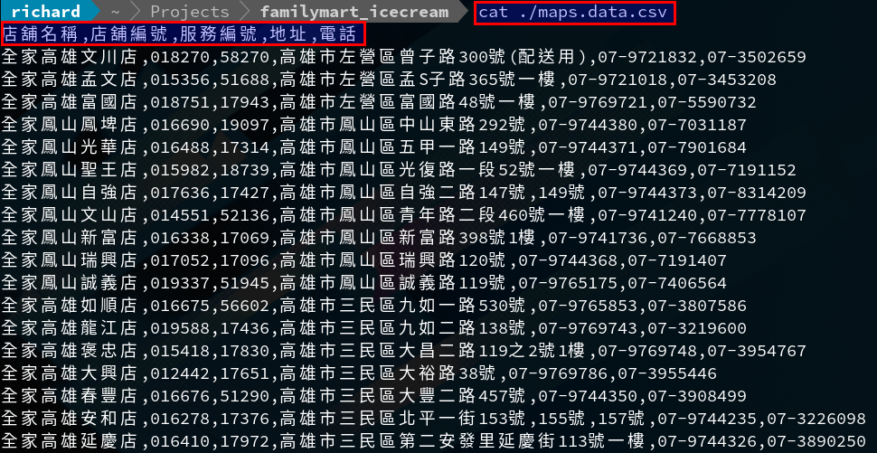

10. 接著就是登入至[Google我的地圖](https://www.google.com/mymaps/?hl=zh-TW "我的地圖")建立自訂地點。

 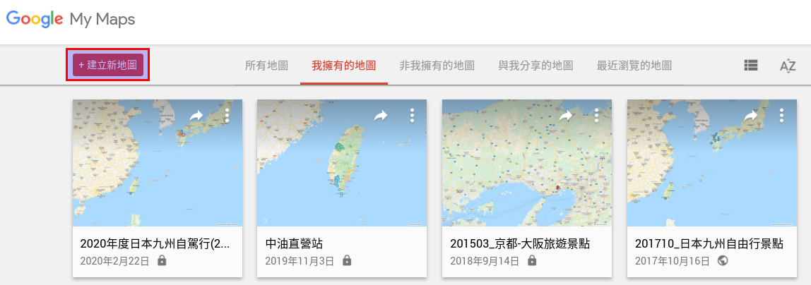

11. 輸入自訂地圖的名稱。

 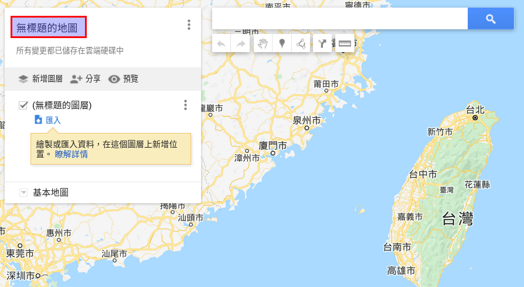

 這裡就以**全家冰店(高雄市)**作為示範吧。

 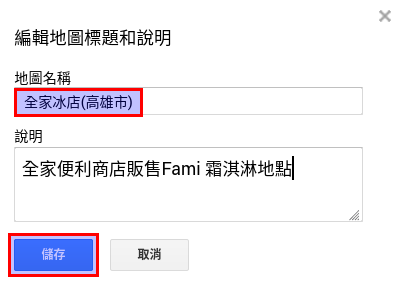

12. 點選**匯入**以上傳我們剛剛彙整好的CSV檔。請按以下步驟完成匯入作業。

 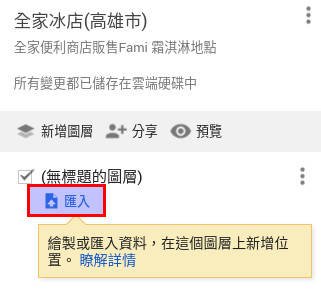

 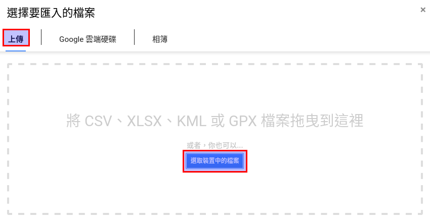

 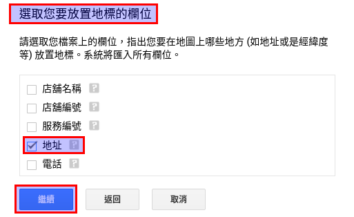

 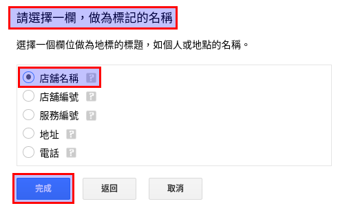

13. 匯入完成後，會在右側地圖區域顯示所建立地點。

 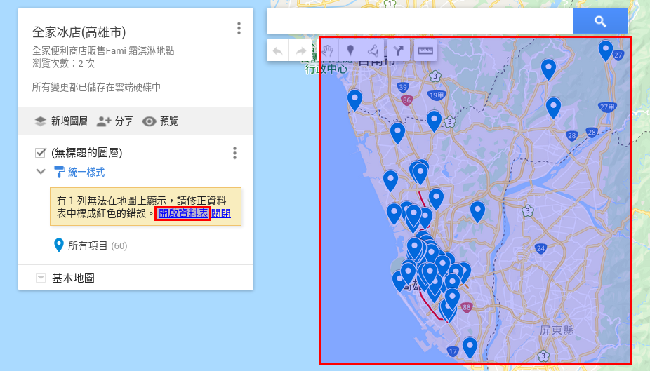

 匯入資料有時**無法識別**，需要**手動介入修正**即可。

 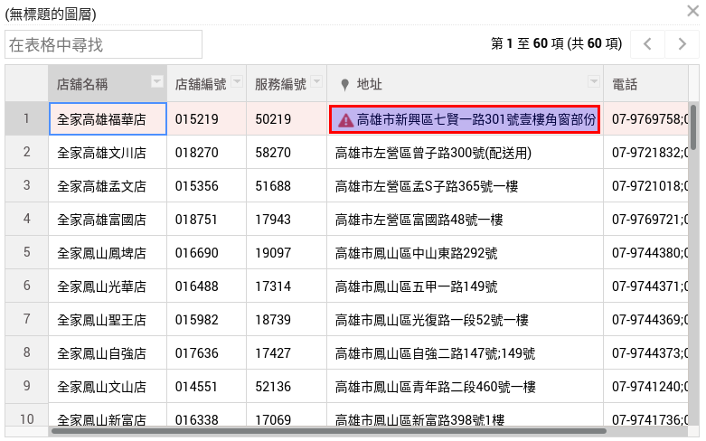
 

14. 修正完成後，點選一個標注處，確認店舖資訊是否顯示正確。

 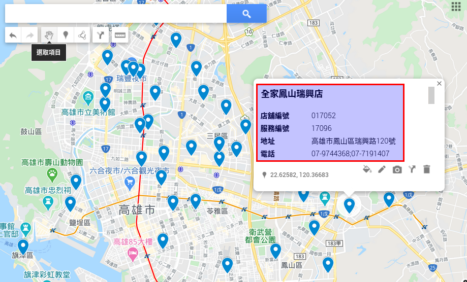

15. 如果大致沒有問題，可以使用電腦或手機，開啟Google地圖。開啟**選單**，選擇**我的地點**。

 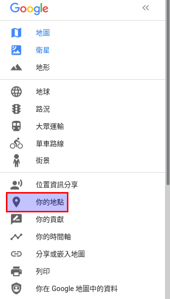

 就可以看到我們剛剛自訂的地圖。如果要分享給朋友就按照一般分享的方式就可以了！

 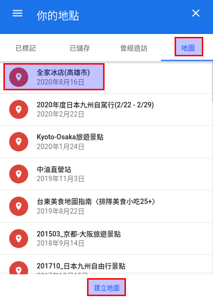

16. 當然，預設的標示圖案及顏色，都可以在自訂地圖中自行調整。

 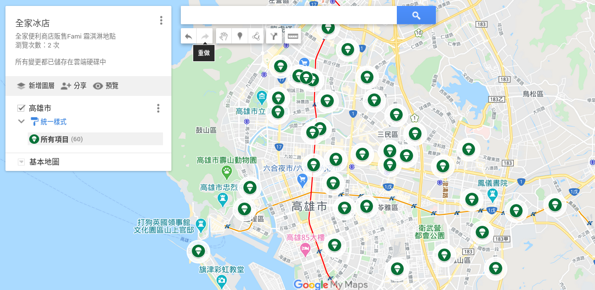
